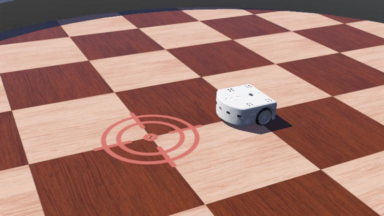

# Robot Programming Benchmark

## Description
Learn how to program a robot, save your controller program, revert and run the simulation.

  

## Information
- Difficulty: 1
- Robot: Thymio2
- Language: Python
- Commitment: A few minutes
